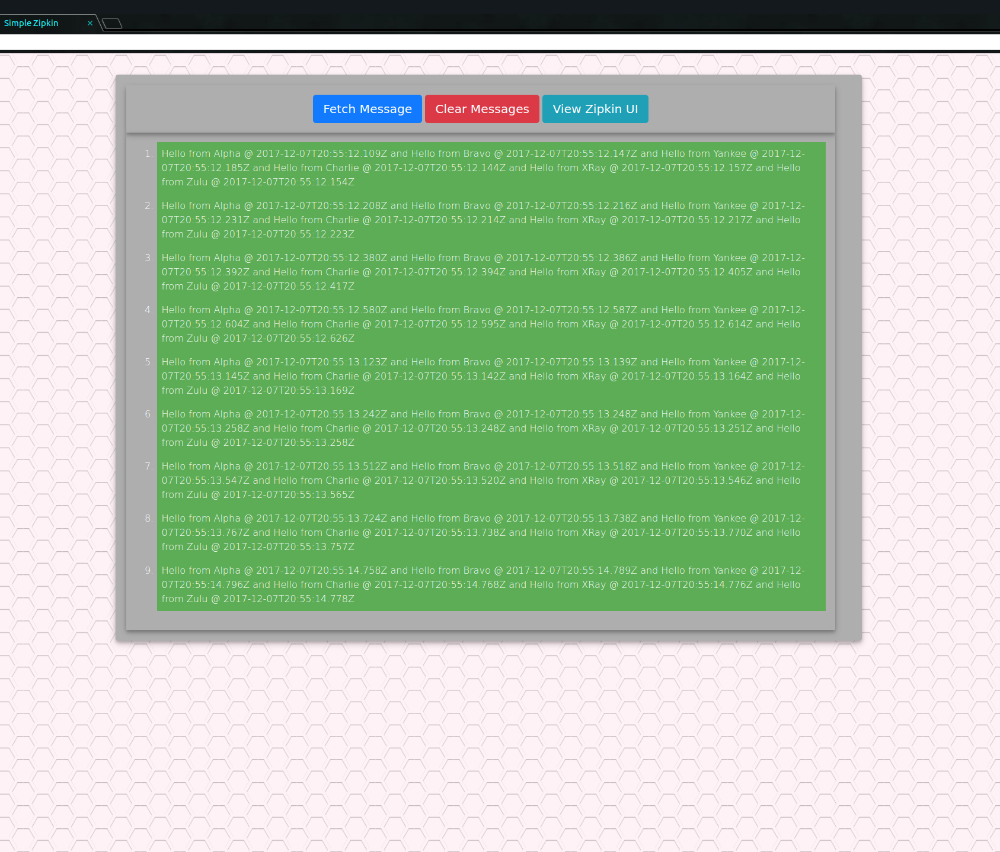

# Distributed Tracing...Sort of...

This project demonstrates the capabilities of Zipkin's ability to trace distributed Systems, without really having requests go no further than the server initially queried.
Meaning that all call dependencies remain on a single server.

To run the sample you will need:
  - Internet Connection (At least the first time it is run)
  - [Docker 17.09.0](https://www.docker.com/) 
  - [Docker-Compose 1.12.0](https://docs.docker.com/compose/install/)
 
 

The following code base contains two runnable web application servers.

The first is located in the "zipkin-server" directory.
Which should come to no surprise, contains a Spring flavored Zipkin Stream Server.
Allowing other applications running Spring Cloud Sleuth Stream, to send its Span information to this server.
Provided correct configurations and an available RabbitMQ server.
The Zipkin server will run on a different port than the well known default port.
In this repository, the server will be running on the host port 7865, but is running on port 80 on guest. 
Meaning if you run it on your local box, then it will run on port 80. 
However in the compose project I have mapped port 80 to port 7865 on your machine.

The second server is located in the "async-rest" directory.
This server has several HTTP GET REST endpoints exposed:

- http://localhost/get/message
- http://localhost/alpha
- http://localhost/bravo
- http://localhost/charlie
- http://localhost/xray
- http://localhost/yankee
- http://localhost/zulu

Which should have a trace that looks like this:

To run the entire project using docker:
1. Open a command line with the root of this repository as the present working directory.
1. Run `docker-compose up -d`

#### Open a web browser and enter the following address: `http://localhost:7866` assuming you changed the port for the async-rest project to 7866

This should output something like this to the browser window
    

(provided you clicked fetch message a few times.)

You should now be able to access the Zipkin UI, and have at least one trace, in a browser window as well at `http://localhost:7865/`

Provided that the "End Time" parameter of the trace query is at or after the time you made your browser requests, you should get something that looks like this!

Enjoy!

-Alex