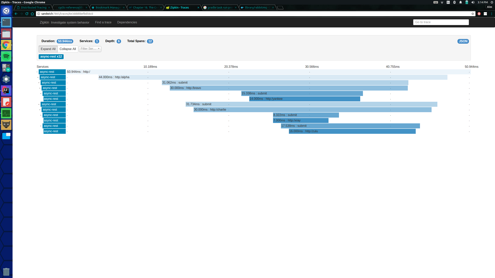
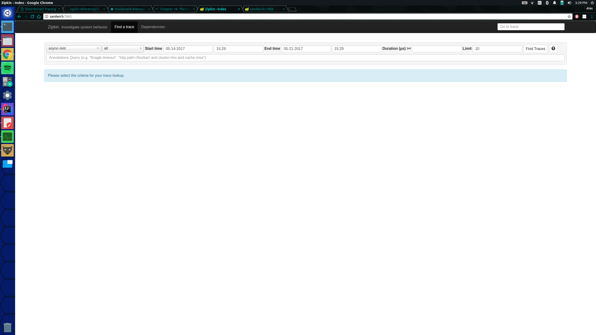
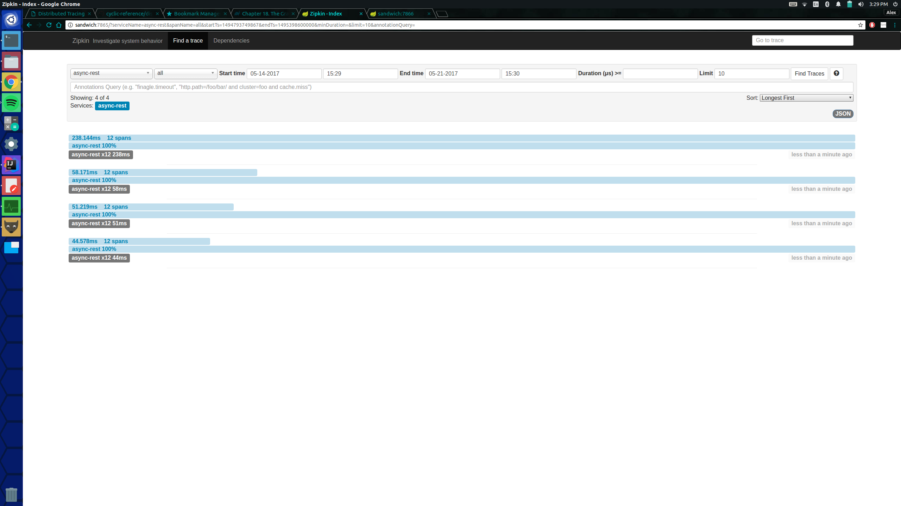

#Distributed Tracing...Sort of...

This project demonstrates the capabilities of Zipkin's ablity to tracing distributed Systems, without really having requests go no further than the initial server initially queried.
Meaning that all dependencies remain on a single server.

To run the sample you will need:
 - Internet Connection (At least the first time it is run)
 - [Java 8 runtime](http://blog.acari.io/jvm/2017/05/05/Gradle-Install.html)
 - [Gradle 2.3+ ](http://blog.acari.io/jvm/2017/05/05/Gradle-Install.html)
 - [RabbitMQ](https://www.rabbitmq.com/download.html), alternatively through a [Docker Image](https://hub.docker.com/_/rabbitmq/) running on port 5672

The following code base contains two runnable web application servers.

The first is located in the "zipkin-server" directory.
Which should come to no, contains a Spring flavored Zipkin Stream Server.
Allowing other applications running Spring Cloud Sleuth Stream, to send its Span information to this server.
Provided correct configurations and an available RabbitMQ server.
The Zipkin server will run on a different port than the well known default port.
In this repository, the server will be running on port 7865.

The second server is located in the "async-rest" directory.
This server has several HTTP GET REST endpoints exposed:

- http://localhost:7866/
- http://localhost:7866/alpha
- http://localhost:7866/bravo
- http://localhost:7866/charlie
- http://localhost:7866/xray
- http://localhost:7866/yankee
- http://localhost:7866/zulu

Which should have a trace that looks like this:

To run the example.
1. Open a terminal whose current working directory is the zipkin-server directory of this repository.
1. Run `gradle bootRun`
1. Open a terminal whose current working directory is the async-rest directory of this repository.
1. Run `gradle bootRun`
1. Open a web browser and enter the following address: `http://localhost:7866`

This should output something like this to the browser window
    
>Hello from Alpha @ 2017-05-21T19:38:54.601Z and Hello from Bravo @ 2017-05-21T19:38:54.612Z and Hello from Yankee @ 2017-05-21T19:38:54.619Z and Hello from Charlie @ 2017-05-21T19:38:54.614Z and Hello from XRay @ 2017-05-21T19:38:54.621Z and Hello from Zulu @ 2017-05-21T19:38:54.633Z

You should now be able to access the Zipkin UI, and have at least one trace, in a browser window as well at `http://localhost:7865/`

Provided that the "End Time" parameter of the trace query is at or after the time you made your browser requests, you should get something that looks like this!

Enjoy!

-Alex